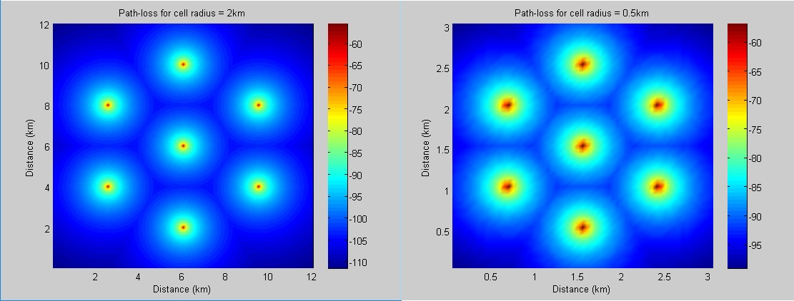
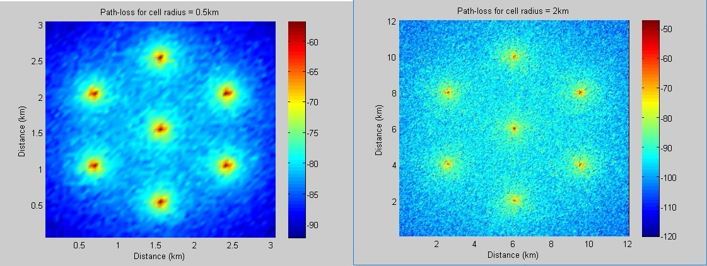
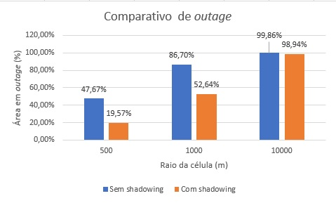
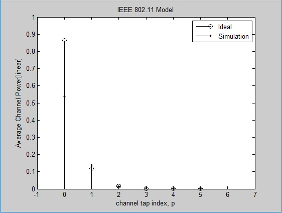

:stylesheet: clean.css

:toc: left

:stem: latexmath

= Projetos da disciplina Comunicações Móveis
Autor: Wellerson 

:sectnums:

== Mapa de Potência

=== Introdução
O objetivo dessa prática foi criar uma simulação no MATLAB de um sistema com sete antenas e mostrar o efeito da perda de percurso e do shadowing na potencia recebida pelos dispositivos móveis. A descrição completa da simualação e minhas análises podem ser encontradas link:https://github.com/wellerson-oliveira/Projetos-comunicoes-moveis/blob/master/Unidade%202/relatorio_prova_1.pdf[aqui]. O código-fonte pode ser baixado link:https://github.com/wellerson-oliveira/Projetos-comunicoes-moveis/tree/master/Unidade%202/codes/Exp%201[aqui]

=== Simulação 
O sistema a ser simulado tem as seguintes especificações:

* Número de antenas: Sete. Dispostas em um hexágono com uma central;
* Altura das torres: 30 metros;
* Altura do dispositivo móvel: 1.5 metro;
* Potência de Transmissão: 20W;
* Frequência: 1900 Mhz;
* Potência mínima de recepção: -90 dBW

As especificações de raio da célula são um parâmtetro da simulação, definido pelo usuário. Considerou-se que a potência recebida em determinado ponto é a maior potência que chega nesse ponto, vinda de cada uma das sete antenas do sistema. 

Inicilamente simulou-se o sistema apenas com o efeito da perda de percurso. A Figura abaixo mostra a simulação do sistema para dois raios de célula: 500 metros e 2000 metros. 

[#img-comparativo-pot]
.Sistema com perda de percurso para raio a) 2000 metros b) 500 metros

Podemos ver que, devido a consideração apenas da perda de percurso, o gráfico fica suave, já que o único parametro que varia é a distância. Também fica bem claro que, quanto menor o raio das células (isto é, a metade da distância entre uma torre e sua vizinha) melhor a cobertura. 

Agora, inseriu-se o efeito de shadowing no sistema. Esse efeito é modelado somando-se uma variável aleatória gaussiana com media zero e desvio padrão 10dB. O efeito do shadowing é aleatório e por isso, dependendo do raio da célula ele pode alterar consideravelmente a taxa de outage do sistema. Pode-se ver o efeito do shadowing na Figura abaixo.

[#img-mapa_perda_shad]
.Sistema com perda de percurso e shadowing para raio a) 2000 metros b) 500 metros

Na Figura abaixo é mostrado numericamente o efeito do shadowing no sistema com diferentes raios. Podemos ver que o shadowing é bastante agressivo para sistemas com raio de célula menores. Isso se deve ao efeito aleatório do shadowing e está explicado no fim da página 2 do link:https://github.com/wellerson-oliveira/Projetos-comunicoes-moveis/blob/master/Unidade%202/relatorio_prova_1.pdf[relatório].

[#img-outage-1]
.Taxas de outage para o sistema apenas com perda de percurso para diferentes raios

== Perfil Atraso-Potencia do Wifi

=== Introdução
O objetivo dessa prática é analisar o perfil atraso-potencia (PDP) do modelo WiFi indoor definido pelo IEEE 802.11b task Group. Será simulado o canal e calculado o PDP para comparação com o modelo teórico. A partir do PDP calculado será verificado também a banda de coerência do canal e, para fins de comparação verificaremos se o canal analisado é seletivo ou plano em frequência para dois sistemas: AMPS (30kHz de banda) e GSM (200kHz de banda). 

=== Simulação
O PDP de um canal é uma forma de analisar como o multipercurso afeta o sinal recebido. Ele modela como a potencia dos varios multipercursos chega ao receptor. O efeito do PDP pode ser visto na frequência, onde podemos definir um importante parâmetro na caracterização de canal: A banda de coerência.

Para essa simulação, fizemos a comparação de dois PDP's: Um com delay-spread de 25ns e outro com 100ns. O delay-spread é uma medida de quão severo é o PDP do canal analisado, de maneira que quanto maior o delay-spread, maior é a energia que as cópias do sinal que chegam atrasadas têm e, portanto, tornam o canal mais severo. A Figura 4 mostra o PDP para o canal com delay-spread de 25ns.

[#img-pdp25]
.Perfil atraso-potencia de um canal com delay spread de 25ns

