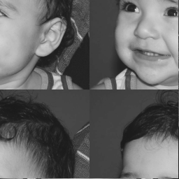

:stylesheet: clean.css

:toc: left

= Projetos da disciplina Processamento Digital de Imagens
Autor: Wellerson 

:sectnums:

== Negativo de Uma Imagem

=== Objetivo
O objetivo dessa atividade é criar um programa em Python que dada uma imagem, exiba o negativo dessa imagem apenas em uma região retangular delimitada por dois pontos escolhidos pelo usuário.

=== Implementação
Dada uma imagem e dois pontos, (x1, y1) e (x2, y2), dentro das dimensões da imagem, basta varrer a imagem do ponto x1 até o ponto x2 e do ponto y1 até o ponto y2, alterando o valor daquele pixel, p_n, para um novo valor dado por 255 - p_n. Você pode baixar o código fonte link:https://github.com/wellerson-oliveira/Projetos-PDI/tree/master/negativo_imagem[aqui]

== Troca de regiões

=== Objetivo
O objetivo dessa atividade é criar um programa em Python que dada uma imagem, divida-a em quatro retangulos e exiba uma imagem com as posições dos retangulos trocadas.Vamos usar a imagem fornecida pelo professor como exemplo.

image::gabriel.png[Imagem a ser processada]

=== Implementação
A implementação dessa atividade foi bastante simples. Dada uma imagem, utilizou-se as dimensões da mesma para obter os pixels que dividem a imagem em quatro. Por fim, criou-se uma cópia da imagem e varrendo a imagem inicial, copiamos os tons de cinza de cada retangulo para o retangulo oposto. Você pode baixar o código fonte link:https://github.com/wellerson-oliveira/Projetos-PDI/tree/master/troca-de-regioes[aqui].

== Contador de objetos

=== Objetivo
O objetivo dessa atividade é criar um programa em Python que dada uma imagem-exemplo, conte o número de objetos que estão na imagem, sem contar objetos que tocam na borda. O programa também deverá ser capaz de contar quantos objetos na imagem são "ocos", isto é, possuem buracos dentro dele. A imagem a ser processada tem apenas dois tons: branco (tom de cinza 255) e preto (tom de cinza 0), apenas por simplicidade.

=== Implementação
Para implementação dessa prática, o primeiro passo foi a elaboração da função *floodfill*. A função *floodfill* é uma rotina simples para preenchimento de regiões que possuam um mesmo tom de cinza. Ela tem os seguintes argumentos:

* Semente: Coordenadas x e y nas quais se deseja iniciar o preenchimento.
* Rotulo: Novo valor que será atribuido para o objeto.

Na função *floodfill* pode-se usar o conceito de 8-vizinhos ou 4-vizinhos. Nessa prática, utilizou-se o 4-vizinhos. A função inicia a partir da semente e verifica quais vizinhos têm o mesmo tom de cinza da semente e, ao encontrar, adiciona o pixel em uma lista. Após testar todos os vizinhos, pega-se o primeiro elemento da lista e atribui o valor do rotulo para esse pixel. Esses passos são repetidos até que a lista esteja vazia. 

Para contar regiões, utilizamos a função floodfill para preencher cada objeto com um rotulo diferente. O processo consiste em varrer a imagem até encontrar um pixel branco. Ao encontrar, executa-se o *floodfill* utilizando esse pixel como semente. Ao preencher, incrementa-se o rótulo e volta-se a varrer a imagem até que todas as regiões estejam rotuladas. Conta-se o número de regiões, utilizando o valor do último rotulo. 

Antes, entretanto, é necessário remover as regiões que estão na borda da imagem. Para isso, basta percorrer as linhas e colunas da borda e executar o *floodfill* para todos os pixels brancos encontrados. 

Por fim, para contar o número de objetos que têm buraco, utiliza-se o *floodfill* no primeiro pixel da imagem, preenchendo o funda da imagem com um tom de cinza diferente de 0. Após isso, basta varrer a imagem linha por linha e buscar pixels com tom de cinza 0. Ao encontrar, verifica-se o tom de cinza imediantamente à esquerda deste e, caso este tenha um tom de cinza diferente do fundo, incrementa-se o contador de regiões com buraco. Após esse passo, é importante executar o *floodfill* no pixel de tom de cinza 0 (que representa o buraco na região) e no pixel imediatamente à esquerda deste (pixel que pertence a região que tem um buraco), pois é possível que alguma região tenha dois buracos, e estas devem ser contadas apenas uma vez. Assim, quando o algoritmo continuar a varredura e encontrar o pixel com tom de cinza 0 referente ao outro buraco da figura, ao testar o pixel imadiatamente à esquerda, este será do tom de cinza do fundo e portanto o contador de regiões com buraco não será incrementado. Você pode baixar o código fonte link:https://github.com/wellerson-oliveira/Projetos-PDI/tree/master/contador-objetos[aqui]

== 

