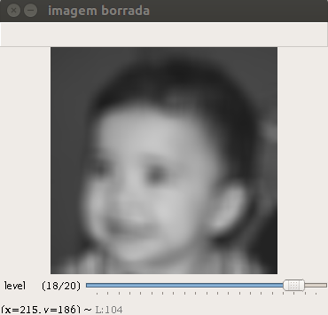
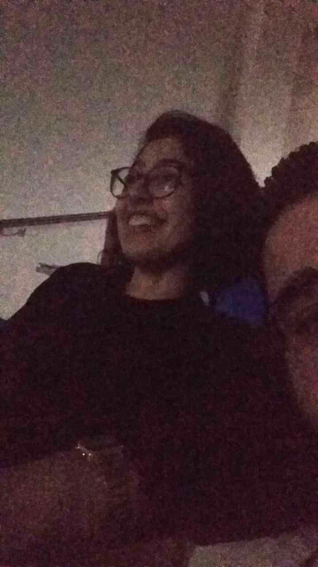

:stylesheet: clean.css

:toc: left

:stem: latexmath

= Projetos da disciplina Processamento Digital de Imagens
Autor: Wellerson 

:sectnums:

== Negativo de Uma Imagem

=== Objetivo
O objetivo dessa atividade é criar um programa em Python que dada uma imagem, exiba o negativo dessa imagem apenas em uma região retangular delimitada por dois pontos escolhidos pelo usuário. Usaremos a imagem link:https://github.com/wellerson-oliveira/Projetos-PDI/blob/master/images/gabriel.png[gabriel.png] fornecida pelo professor como exemplo nessa prática e em algumas outras.

[#img-gabriel]
.Imagem a ser processada
image::images/gabriel.png[Imagem a ser processada]

=== Implementação
Dada uma imagem e dois pontos, (x1, y1) e (x2, y2), dentro das dimensões da imagem, basta varrer a imagem do ponto x1 até o ponto x2 e do ponto y1 até o ponto y2, alterando o valor daquele pixel, p_n, para um novo valor dado por 255 - p_n. Você pode baixar o código-fonte link:https://github.com/wellerson-oliveira/Projetos-PDI/tree/master/negativo_imagem[aqui].

[#img-negativo]
.Imagem com retangulo negativo
image::images/negativo_imagem.png[Imagem negativa]

== Troca de regiões

=== Objetivo
O objetivo dessa atividade é criar um programa em Python que dada uma imagem, divida-a em quatro retangulos e exiba uma imagem com as posições dos retangulos trocadas.Vamos usar novamente a imagem fornecida pelo professor como exemplo.

=== Implementação
A implementação dessa atividade foi bastante simples. Dada uma imagem, utilizou-se as dimensões da mesma para obter os pixels que dividem a imagem em quatro. Por fim, criou-se uma cópia da imagem e varrendo a imagem inicial, copiamos os tons de cinza de cada retangulo para o retangulo oposto. Você pode baixar o código-fonte link:https://github.com/wellerson-oliveira/Projetos-PDI/tree/master/troca-de-regioes[aqui].

[#img-troca]
.Imagem com regiões trocadas
image::images/troca_regiao.png[Imagem trocada]

== Contador de objetos

=== Objetivo
O objetivo dessa atividade é criar um programa em Python que dada uma imagem-exemplo, conte o número de objetos que estão na imagem, sem contar objetos que tocam na borda. O programa também deverá ser capaz de contar quantos objetos na imagem são "ocos", isto é, possuem buracos dentro dele. A imagem a ser processada tem apenas dois tons: branco (tom de cinza 255) e preto (tom de cinza 0), apenas por simplicidade. A Figura 4 é a imagem fornecida pelo professor para realização dessa prática. Ela pode ser baixada link:https://github.com/wellerson-oliveira/Projetos-PDI/blob/master/images/bolhas.png[aqui].

[#img-bolhas]
.Imagem a ser processada 
image::images/bolhas.png[Imagem inicial]

=== Implementação
Para implementação dessa prática, o primeiro passo foi a elaboração da função *floodfill*. A função *floodfill* é uma rotina simples para preenchimento de regiões que possuam um mesmo tom de cinza. Ela tem os seguintes argumentos:

* Semente: Coordenadas x e y nas quais se deseja iniciar o preenchimento.
* Rotulo: Novo valor que será atribuido para o objeto.

Na função *floodfill* pode-se usar o conceito de 8-vizinhos ou 4-vizinhos. Nessa prática, utilizou-se o 4-vizinhos. A função inicia a partir da semente e verifica quais vizinhos têm o mesmo tom de cinza da semente e, ao encontrar, adiciona o pixel em uma lista. Após testar todos os vizinhos, pega-se o primeiro elemento da lista e atribui o valor do rotulo para esse pixel. Esses passos são repetidos até que a lista esteja vazia. 

Inicialmente, é necessário remover as regiões que estão na borda da imagem. Para isso, basta percorrer as linhas e colunas da borda e executar o *floodfill* para todos os pixels brancos encontrados. A imagem abaixo mostra a imagem sem os objetos que tocam as bordas.

[#img-bolhas-sem-borda]
.Imagem sem os obejtos que tocam a borda 
image::images/bolhas_sem_borda.png[Imagem sem borda]

Para contar regiões, utilizamos a função floodfill para preencher cada objeto com um rotulo diferente. O processo consiste em varrer a imagem até encontrar um pixel branco. Ao encontrar, executa-se o *floodfill* utilizando esse pixel como semente. Ao preencher, incrementa-se o rótulo e volta-se a varrer a imagem até que todas as regiões estejam rotuladas. Conta-se o número de regiões, utilizando o valor do último rotulo. 

[#img-bolhas-rotulada]
.Imagem rotulada 
image::images/bolhas_rotulada.png[Imagem rotulada]

Por fim, para contar o número de objetos que têm buraco, utiliza-se o *floodfill* no primeiro pixel da imagem, preenchendo o funda da imagem com um tom de cinza diferente de 0. Após isso, basta varrer a imagem linha por linha e buscar pixels com tom de cinza 0. Ao encontrar, verifica-se o tom de cinza imediantamente à esquerda deste e, caso este tenha um tom de cinza diferente do fundo, incrementa-se o contador de regiões com buraco. Após esse passo, é importante executar o *floodfill* no pixel de tom de cinza 0 (que representa o buraco na região) e no pixel imediatamente à esquerda deste (pixel que pertence a região que tem um buraco), pois é possível que alguma região tenha dois buracos, e estas devem ser contadas apenas uma vez. Assim, quando o algoritmo continuar a varredura e encontrar o pixel com tom de cinza 0 referente ao outro buraco da figura, ao testar o pixel imadiatamente à esquerda, este será do tom de cinza do fundo e portanto o contador de regiões com buraco não será incrementado. Você pode baixar o código-fonte link:https://github.com/wellerson-oliveira/Projetos-PDI/tree/master/contador-objetos[aqui].

== Filtro borramento

=== Objetivo
O objetivo dessa prática é utilizar a função *filter2d* da opencv para criar um filtro que borre uma dada imagem. Usaremos a imagem link:https://github.com/wellerson-oliveira/Projetos-PDI/blob/master/images/gabriel.png[gabriel.png] mais uma vez como exemplo. Nessa prática, incluiremos também uma barra para que o usuário possa, interativamente, alterar o nível de borramento da imagem. 

=== Implementação
Para criar o efeito de borramento na imagem utilizando a função *filter2d*, é necessário a criação de uma matriz secundária chamada *kernel*. A matriz *kernel* é passada como argumento para a *filter2d* e será convoluída pela imagem original para formar a imagem de saída. A operação de convolução para imagens digitais é uma operação matemática onde o *kernel* é posicionado em cada pixel da imagem original, e o valor desse pixel na imagem final é definido como sendoa soma do produto, pixel a pixel, da imagem original pelo *kernel*. Matematicamente:

asciimath:[g(x, y) = \sum_{s=-a}^a \sum_{t=-b}^b w(s, t) * f(x + s, y + t)]

Para implementação do filtro de borramento, criaremos um *kernel* que consiste em uma matriz quadrada NxN, cujo valor de cada elemento da matriz será stem:[\frac{1}{NxN}]. Para essa prática, como dito anteriormente, criaremos uma barra onde o usuário pode alterar o nível de borramento da imagem. Na prática, ele estará alterando o valor de N. Abaixo, temos a saída do programa com dois níveis de borramento. Como sempre, o código-fonte pode ser baixado link:https://github.com/wellerson-oliveira/Projetos-PDI/tree/master/filtro-borramento[aqui].

[#img-gabriel-borrada-5]
.Imagem com filtro borramento 5x5
image::images/borrada_5.png[Imagem rotulada]

[#img-gabriel-borrada-18]
.Imagem com filtro borramento 18x18

== Normalização de histograma

=== Objetivo
O objetivo dessa prática é utilizar a função *normalize* para normalizar o histograma de uma imagem. A normalização de um histograma, serve para aumentar o contraste em uma imagem. A operação de normalização, pega uma imagem e recalcula seus pixels de maneira que eles fiquem distribuídos em todos os níveis de tons (de 0 a 255), aumentando assim o contraste entre tons diferentes. Para essa prática, usaremos uma foto cedida por uma amiga. A imagem link:https://github.com/wellerson-oliveira/Projetos-PDI/blob/master/images/rapha.png[rapha.png] foi autorizada por Raphaela para ser usada. 

[#img-rapha]
.Imagem original
image::images/rapha.png[Imagem rotulada]

=== Implementação
A normalização de histograma é feita utilizando a função *normalize* da opencv. Essa função recebe uma imagem, normaliza-a e armazena-a em uma nova imagem de mesmo tamanho. A imagem normalizada apresenta um histograma mais distribuído, aumentando o contraste entre tons. A seguinte Figura mostra o histograma da imagem link:https://github.com/wellerson-oliveira/Projetos-PDI/blob/master/images/rapha.png[rapha.png] original. 
Para plotagem dos histogramas, utilizou-se a biblioteca *matplotlib*. 

[#img-hist-rapha]
.Histograma da imagem original	
image::images/hist_original.png[Imagem rotulada]

É possível ver que os tons das cores RGB estão todos concentrados à esquerda do histograma (Não há nenhum tom acima do nível 100, por exemplo) o que caracteriza uma imagem escura. Abaixo, temos a imagem normalizada e seu histograma. 

[#img-new-rapha]
.Imagem normalizada

[#img-hist-new]
.Histograma da imagem normalizada
image::images/hist_new.png[Imagem rotulada]

É possível ver um contraste maior entre as cores da nova imagem, confirmada pelo seu histograma. Seus tons agora estão mais espaçados no histograma, que ocupa agora praticamente todos os níveis. O lado negativo é que pode-se ver que essa operação aumenta o ruído já presente na imagem original. O código-fonte está disponível link:https://github.com/wellerson-oliveira/Projetos-PDI/tree/master/normalizacao-histograma[aqui]

== Tilt-shift

=== Objetivo
o objetivo dessa prática é criar, utilizando a biblioteca OpenCV, o efeito conhecido como *tilt-shift*. O efeito *tilt-shift* é criado mecanicamente inclinando a lente da câmera. Essa inclinação faz com que um objeto fique em foco enquanto outros que estão no mesmo plano sejam fotografados sem foco. É possível criar um efeito de miniatura em imagens através desse efeito. A imagem utilizada nessa prática está disponível link:https://github.com/wellerson-oliveira/Projetos-PDI/blob/master/images/emirates.png[aqui]. A imagem foi baixada originalmente no ótimo site link:https://www.desktopbackground.org/wallpaper/fonds-decran-emirates-stadium-tous-les-wallpapers-emirates-stadium-557833/[desktopbackground.org]

=== Implementação
Para criar o efeito *tilt-shift*, vamos nos utilizar do efeito link:https://wellerson-oliveira.github.io/Engenharia_Eletrica/Processamento_Digital_Imagens/index.html#_filtro_borramento[borramento], já apresentado nesse site, para criar o efeito de uma imagem fora de foco. Assim, com a imagem original e uma cópia borrada, pode-se combinar as duas utilizando uma soma ponderada para criar o *tilt-shift*. O peso da soma ponderada será feito utilizando a seguinte equação:

asciimath:[\alpha = \frac{tanh(\frac{x - L1}{d}) - tanh(\frac{x - L2}{d}) }{2}]

