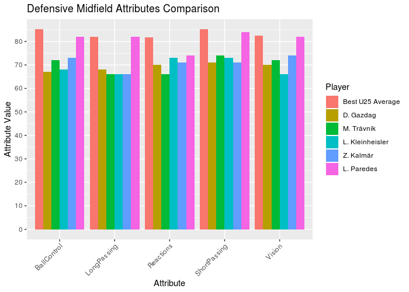

:stylesheet: clean.css

:icons: font

= Finding the best free players to FIFA 19 career mode using R · Wellerson Oliveira

image::/../../images/presentation_image.png[presentation, 250, 250, align = "center"]

[.text-center]
icon:github[size=1.5x, link="https://github.com/wellerson-oliveira", align = "center"] | icon:twitter[link="https://twitter.com/_WellersonVO", align = "center"] | icon:linkedin[link="https://www.linkedin.com/in/wellerson-oliveira-aa121410a/", align = "center"] | icon:google-plus[link="https://plus.google.com/u/0/115562689876020120903", align = "center"]

[.text-center]
**link:/../../index.html[Home Page]**

[.text-center]
_If you are a FIFA 19 player as me, you'll like this article. Here we are going to use the kaggle dataset link:https://www.kaggle.com/karangadiya/fifa19[FIFA 19 complete player dataset] to find free cost best players for your career mode. To do this, we are going to find the mainly attributes for each player position and then compare the best players with the players with no club to find the bests._ 

---

Let's begin importing the packages that we are going to use: **datatable** and **ggplot2**. Then let's read the data using the **fread** function provided from the **datatable** package. Since the file is already in a regular csv format, it's not necessary to use any other argument.

[source, ruby]
%% importing packages
   import(data.table)
   import(ggplot2)

[source, ruby]
%% readind data
   dt <- fread(input = "data.csv")

Let's start doing some data cleaning.First, let's remove some columns that are not important for our analysis. 

[source, ruby]
%% - removing some columns
  dt <- dt[, !c("V1", "Photo", "Flag", "Club Logo", "Special", "Body Type", "Real Face", "Jersey Number", "Joined")]
  
Then, let's deal with the money columns: Value and Wage. Using the **head** function, we can see there are some symbols on these columns. There's the current symbol '€' and the letters 'M' and 'K' indicating the magnitude of the number. 

[source, ruby]
   head(dt[, c("Value", "Wage")])

[source, ruby]
     Value  Wage
1: €110.5M €565K
2:    €77M €405K
3: €118.5M €290K
4:    €72M €260K
5:   €102M €355K
6:    €93M €340K

Let's correct these columns to create numeric columns. We are going to use the **gsub** function to replace the '€' symbol for nothing in both columns. 

[source, ruby]
%% - adjusting money columns
  # - replacing current symbol
  dt[, Value := gsub("€", "", Value)]
  dt[, Wage  := gsub("€", "", Wage )]

To do the magnitude transformation we are going to use de **mapply** function. The **mapply** is a function that receive another function, pass one or more vectors as a parameter to that function and return another list with results. First, let's define our function.
  
[source, ruby]
%% - function to transform money columns
  x <- function(Value){
    if (grepl("M", Value)){
      real_value <- as.numeric(gsub("M", "", Value))*1000000
    } else if (grepl("K", Value)){
      real_value <- as.numeric(gsub("K", "", Value))*1000
    } else {
      real_value <- as.numeric(Value)
    }
    return(real_value)
  }

Now, let's use **mapply** passing first the Value column and after the Wage column as parameters. Then, we use the result of each **mapply** to create new columns in the dataset. 

[source, ruby]
%% - using mapply
  real_values <- mapply(x, dt[, Value])
  real_wage   <- mapply(x, dt[, Wage ])
%% - creating new columns
  dt <- cbind(dt, real_values)
  dt <- cbind(dt, real_wage)

Ok, now it's time to start the analysis. In FIFA, we have a lot of player positions. Using the **unique** function we can see all of them. 

[source, ruby]
%% -   
  unique(dt[, Position])

[source, ruby]
 [1] "RF"  "ST"  "LW"  "GK"  "RCM" "LF"  "RS"  "RCB" "LCM" "CB"  "LDM" "CAM" "CDM" "LS"  "LCB" "RM"  "LAM" "LM"  "LB"  "RDM" "RW" 
[22] "CM"  "RB"  "RAM" "CF"  "RWB" "LWB" ""

These positions are very specific. To create a better analysis, let's aggregate these functions in more general functions: 
- GK: For goalkeepers
- DEF: To defenders
- MID-DEF: To defenders midfielders
- MID-ATA: To attackers midfielders
- ATA-LAT: To lateral attackers
- ATA: To central attackers

To do that, we are going to create a new datatable containing the "transformation". Then, we are going to use the **merge** function to join the two datatables and give a general position to each player. 

[source, ruby]
%% - creating new datatable
  dt.pos <- data.table("Position" = unique(dt[, Position]))
  dt.pos[, Gen_Position := ""]
  
  dt.pos[Position %in% c("GK"), Gen_Position := "GK"]
  dt.pos[Position %in% c("RB", "CB", "LB", "SW", "RWB", "LWB", "RCB", "LCB"), Gen_Position := "DEF"]
  dt.pos[Position %in% c("CDM", "CM", "RCM", "LCM", "LDM", "RDM"), Gen_Position := "MID-DEF"]
  dt.pos[Position %in% c("LOM", "ROM", "LM", "RM", "LWM", "RWM", "RAM", "LAM", "CAM", "OM"), Gen_Position := "MID-ATA"]
  dt.pos[Position %in% c("RW", "LW", "LF", "RF"), Gen_Position := "ATA-LAT"]
  dt.pos[Position %in% c("ST", "CF", "RS", "LS"), Gen_Position := "ATA"]
  
[source, ruby]
%% - joining the two datatables
  dt <- merge(dt, dt.pos, "Position")

Now we have a dataset containing all the players, values and wages and a general position. Let's go the attributes. In FIFA we have 34 attributes that defines how good is each player. The players also have an overall that indicates in one number the player level. Let's create a vector containing all attributes. 

[source, ruby]
%% - attributes
  att <- c("Crossing", "Finishing", "HeadingAccuracy", "ShortPassing", "Volleys", "Dribbling", "Curve", "FKAccuracy", "LongPassing",         "BallControl", "Acceleration", "SprintSpeed", "Agility", "Reactions", "Balance", "ShotPower", "Jumping", "Stamina", "Strength", "LongShots", "Aggression", "Interceptions", "Positioning","Vision","Penalties","Composure", "Marking", "StandingTackle", "SlidingTackle", "GKDiving", "GKHandling", "GKKicking", "GKPositioning", "GKReflexes")

Of course there are attributes that are very important for some position and less important for others. What we are going to do is find, for each general position, which attributes are more important. To do that, we are going to use the top-10 players of each position to calculate the average of each attribute and find the top five. 

Let's use the **setorder** function to order the datable based on the Gen_Position and Overall columns. Then, we are going to use the **.SD** trick of the **datatable** package to retrieve the top ten by position. The **.SD** is a abbreviation of **S**ub**D**atatable, and it represent all the subset of **datatable** defined using the command **by = Gen_Position**.  

[source, ruby]
  %% - topten of each new position
  setorder(dt, Gen_Position, -Overall)
  dt.topten <- dt[, .SD[c(1:10), c("Name", ..att)], by = Gen_Position]

Now, we can calculate the average of all the attributes for each Gen_Position. 
 
[source, ruby]
  %% - mean of the attributes of each position
  dt.att <- dt.topten[, cbind("Attribute_Name"  = names(.SD[, c(3:35)]), 
                              data.table("Attribute_Value" = colMeans(.SD[, 3:35]))), by = Gen_Position]

Finding the top five of attributes of each position. 

[source, ruby]
  %%
  setorder(dt.att, Gen_Position,-Attribute_Value)
  dt.att_best <- dt.att[, .SD[c(1:5)], Gen_Position]

Let's take a look on the results.

[source, ruby]
Gen_Position Attribute_Name Attribute_Value
 1:          ATA    Positioning            91.4
 2:          ATA      Finishing            91.0
 3:          ATA      Reactions            89.5
 4:          ATA      ShotPower            88.2
 5:          ATA      Composure            86.7
 6:      ATA-LAT      Dribbling            92.4
 7:      ATA-LAT    BallControl            92.3
 8:      ATA-LAT        Agility            90.7
 9:      ATA-LAT        Balance            89.1
10:      ATA-LAT         Vision            88.1
11:          DEF StandingTackle            88.6
12:          DEF  Interceptions            88.0
13:          DEF  SlidingTackle            87.4
14:          DEF        Marking            86.0
15:          DEF        Jumping            84.3
16:           GK     GKReflexes            88.9
17:           GK       GKDiving            87.6
18:           GK  GKPositioning            86.0
19:           GK     GKHandling            85.7
20:           GK      Reactions            84.6
21:      MID-ATA    BallControl            87.8
22:      MID-ATA      Reactions            87.5
23:      MID-ATA    Positioning            87.1
24:      MID-ATA      Composure            85.7
25:      MID-ATA      Finishing            85.0
26:      MID-DEF   ShortPassing            89.1
27:      MID-DEF    BallControl            87.8
28:      MID-DEF      Reactions            87.0
29:      MID-DEF    LongPassing            86.7
30:      MID-DEF         Vision            86.6

Using this results we can say, for example, that for a lateral attacker is more important the dribble while for a pure attacker positioning and finishing are the most importants. 

Ok, now lets find some players for your FIFA career. Thinking first about money, let's look to the player who doesn't have a club and you can sign for free. 

[source, ruby]
  %% - Players without team (Free)
  dt.noteam <- dt[Club == "", ]
  dt.noteam <- dt.noteam[Age <= 25, ]

We have now all the player under-25 with no club in FIFA 19. Let's find the bests for each position based on the attributes we find. We have to create datatables for each position. Then, we get only the five main attributes for each one and finally we calculate the average of these attributes. Finally we pick the top five based on this average.

[source, ruby]
  %%GK
  a <- dt.att_best[Gen_Position == "GK", Attribute_Name]
  dt.gk <- dt.noteam[Gen_Position == "GK", c("Name", ..a)]
  dt.gk[, Rate := rowMeans(dt.gk[, c(2:5)])]
  setorder(dt.gk, -Rate)
  dt.gk <- dt.gk[c(1:5)]
  
  %% DEF
  a <- dt.att_best[Gen_Position == "DEF", Attribute_Name]
  dt.def <- dt.noteam[Gen_Position == "DEF", c("Name", ..a)]
  dt.def[, Rate := rowMeans(dt.def[, c(2:5)])]
  setorder(dt.def, -Rate)
  dt.def <- dt.def[c(1:5)]
  
  %% MID-DEF
  a <- dt.att_best[Gen_Position == "MID-DEF", Attribute_Name]
  dt.mid_def <- dt.noteam[Gen_Position == "MID-DEF", c("Name", ..a)]
  dt.mid_def[, Rate := rowMeans(dt.mid_def[, c(2:5)])]
  setorder(dt.mid_def, -Rate)
  dt.mid_def <- dt.mid_def[c(1:5)]
  
  %% MID-ATA
  a <- dt.att_best[Gen_Position == "MID-ATA", Attribute_Name]
  dt.mid_ata <- dt.noteam[Gen_Position == "MID-ATA", c("Name", ..a)]
  dt.mid_ata[, Rate := rowMeans(dt.mid_ata[, c(2:5)])]
  setorder(dt.mid_ata, -Rate)
  dt.mid_ata <- dt.mid_ata[c(1:5)]
  
  %% ATA-LAT
  a <- dt.att_best[Gen_Position == "ATA-LAT", Attribute_Name]
  dt.ata_lat <- dt.noteam[Gen_Position == "ATA-LAT", c("Name", ..a)]
  dt.ata_lat[, Rate := rowMeans(dt.ata_lat[, c(2:5)])]
  setorder(dt.ata_lat, -Rate)
  dt.ata_lat <- dt.ata_lat[c(1:5)]
  
  %% ATA
  a <- dt.att_best[Gen_Position == "ATA", Attribute_Name]
  dt.ata <- dt.noteam[Gen_Position == "ATA", c("Name", ..a)]
  dt.ata[, Rate := rowMeans(dt.ata[, c(2:5)])]
  setorder(dt.ata, -Rate)
  dt.ata <- dt.ata[c(1:5)]
 
We have now the top-five Under-25 players with no club in FIFA 19. Let's compare all these player with some of the best Under-25 players in the world and see how good are these players. we are going to use the same code, changing the datatable **dt.noteam** to the datatable **dt[Age <= 25, ]** to include all U-25 players. Then, we are going to get the top 20 and compute the average of the same attributes and include the results in the datatable of each position as "U25 Average Player". 

[source, ruby]
%% --
  dt.young <- dt[Age <= 25, ]

  %% GK
  a <- dt.att_best[Gen_Position == "GK", Attribute_Name]
  dt.gk_all <- dt.young[Gen_Position == "GK", c("Name", ..a)]
  dt.gk_all[, Rate := rowMeans(dt.gk_all[, c(2:5)])]
  setorder(dt.gk_all, -Rate)
  dt.gk_all <- dt.gk_all[c(1:20)]
  
  dt.gk_plot <- rbind(dt.gk, t(c(Name = "Best U25 Average", colMeans(dt.gk_all[, c(2:7)]))))
  
  %% DEF
  a <- dt.att_best[Gen_Position == "DEF", Attribute_Name]
  dt.def_all <- dt.young[Gen_Position == "DEF", c("Name", ..a)]
  dt.def_all[, Rate := rowMeans(dt.def_all[, c(2:5)])]
  setorder(dt.def_all, -Rate)
  dt.def_all <- dt.def_all[c(1:20)]
  
  dt.def_plot <- rbind(dt.def, t(c(Name = "Best U25 Average", colMeans(dt.def_all[, c(2:7)]))))
  
  %% MID-DEF
  a <- dt.att_best[Gen_Position == "MID-DEF", Attribute_Name]
  dt.mid_def_all <- dt.young[Gen_Position == "MID-DEF", c("Name", ..a)]
  dt.mid_def_all[, Rate := rowMeans(dt.mid_def_all[, c(2:5)])]
  setorder(dt.mid_def_all, -Rate)
  dt.mid_def_all <- dt.mid_def_all[c(1:20)]
  
  dt.mid_def_plot <- rbind(dt.mid_def, t(c(Name = "Best U25 Average", colMeans(dt.mid_def_all[, c(2:7)]))))
  
  %% MID-ATA
  a <- dt.att_best[Gen_Position == "MID-ATA", Attribute_Name]
  dt.mid_ata_all <- dt.young[Gen_Position == "MID-ATA", c("Name", ..a)]
  dt.mid_ata_all[, Rate := rowMeans(dt.mid_ata_all[, c(2:5)])]
  setorder(dt.mid_ata_all, -Rate)
  dt.mid_ata_all <- dt.mid_ata_all[c(1:20)]
  
  dt.mid_ata_plot <- rbind(dt.mid_ata, t(c(Name = "Best U25 Average", colMeans(dt.mid_ata_all[, c(2:7)]))))
  
  %% ATA-LAT
  a <- dt.att_best[Gen_Position == "ATA-LAT", Attribute_Name]
  dt.ata_lat_all <- dt.young[Gen_Position == "ATA-LAT", c("Name", ..a)]
  dt.ata_lat_all[, Rate := rowMeans(dt.ata_lat_all[, c(2:5)])]
  setorder(dt.ata_lat_all, -Rate)
  dt.ata_lat_all <- dt.ata_lat_all[c(1:20)]
  
  dt.ata_lat_plot <- rbind(dt.ata_lat, t(c(Name = "Best U25 Average", colMeans(dt.ata_lat_all[, c(2:7)]))))
  
  %% ATA
  a <- dt.att_best[Gen_Position == "ATA", Attribute_Name]
  dt.ata_all <- dt.young[Gen_Position == "ATA", c("Name", ..a)]
  dt.ata_all[, Rate := rowMeans(dt.ata_all[, c(2:5)])]
  setorder(dt.ata_all, -Rate)
  dt.ata_all <- dt.ata_all[c(1:20)]
  
  dt.ata_plot <- rbind(dt.ata, t(c(Name = "Best U25 Average", colMeans(dt.ata_all[, c(2:7)]))))

Now we have the top five players with no clubs compared with the best ones. Let's plot the results and see what we have.

[source, ruby]
  %% GK
  p_gk <- ggplot(data = dt.gk_plot, aes(x = V2, y = as.numeric(V1), fill = factor(Name, levels = rev(unique(dt.gk_plot[, Name]))))) + 
          geom_bar(stat = "identity", position = "dodge") +
          ggtitle("Goalkeeper Attributes Comparison") + 
          xlab("Attribute") +
          ylab("Attribute Value") + scale_y_continuous(breaks = seq(0, 100, 10)) + 
          scale_fill_discrete("Player",breaks = rev(unique(dt.gk_plot[, Name]))) +
          theme(axis.text.x = element_text(angle = 45, hjust = 1))
  
 %% DEF
 p_def <- ggplot(data = dt.def_plot, aes(x = V2, y = as.numeric(V1), fill = factor(Name, levels = rev(unique(dt.def_plot[, Name]))))) + 
          geom_bar(stat = "identity", position = "dodge") +
          ggtitle("Defensor Attributes Comparison") + 
          xlab("Attribute") +
          ylab("Attribute Value")  + scale_y_continuous(breaks = seq(0, 100, 10)) + 
          scale_fill_discrete("Player",breaks = rev(unique(dt.def_plot[, Name]))) +
   theme(axis.text.x = element_text(angle = 45, hjust = 1))
  
 # MID DEF
 p_mid_def <- ggplot(data = dt.mid_def_plot, aes(x = V2, y = as.numeric(V1), fill = factor(Name, levels = rev(unique(dt.mid_def_plot[, Name]))))) + 
              geom_bar(stat = "identity", position = "dodge") +
              ggtitle("Defensive Midfield Attributes Comparison") + 
              xlab("Attribute") +
              ylab("Attribute Value")+ scale_y_continuous(breaks = seq(0, 100, 10)) + 
              scale_fill_discrete("Player",breaks = rev(unique(dt.mid_def_plot[, Name]))) +
   theme(axis.text.x = element_text(angle = 45, hjust = 1))
          
 %% MID ATA
 p_mid_ata <- ggplot(data = dt.mid_ata_plot, aes(x = V2, y = as.numeric(V1), fill = factor(Name, levels = rev(unique(dt.mid_ata_plot[, Name]))))) + 
              geom_bar(stat = "identity", position = "dodge") +
              ggtitle("Attacker Midfield Attributes Comparison") + 
              xlab("Attribute") +
              ylab("Attribute Value")+ scale_y_continuous(breaks = seq(0, 100, 10)) + 
              scale_fill_discrete("Player",breaks = rev(unique(dt.mid_ata_plot[, Name]))) +
   theme(axis.text.x = element_text(angle = 45, hjust = 1))
              
 %% ATA LAT
 p_ata_lat <- ggplot(data = dt.ata_lat_plot, aes(x = V2, y = as.numeric(V1), fill = factor(Name, levels = rev(unique(dt.ata_lat_plot[, Name])))))+ 
              geom_bar(stat = "identity", position = "dodge") +
              ggtitle("Lateral Attacker Attributes Comparison") + 
              xlab("Attribute") +
              ylab("Attribute Value")+ scale_y_continuous(breaks = seq(0, 100, 10)) + 
              scale_fill_discrete("Player",breaks = rev(unique(dt.ata_lat_plot[, Name]))) +
   theme(axis.text.x = element_text(angle = 45, hjust = 1))
              
 %% ATA
 p_ata <- ggplot(data = dt.ata_plot, aes(x = V2, y = as.numeric(V1), fill = factor(Name, levels = rev(unique(dt.ata_plot[, Name]))))) + 
          geom_bar(stat = "identity", position = "dodge") +
          ggtitle("Attacker Attributes Comparison") + 
          xlab("Attribute") +
          ylab("Attribute Value")+ scale_y_continuous(breaks = seq(0, 100, 10)) + 
          scale_fill_discrete("Player",breaks = rev(unique(dt.ata_plot[, Name]))) +
   theme(axis.text.x = element_text(angle = 45, hjust = 1))

image::images/barplot_gk.png[gk, 700, 500, align = "center"]

image::images/bar_def.png[def, 700, 500, align = "center"]

image::images/bra_mid_ata.png[mid_ata, 700, 500, align = "center"]

image::images/bar_ata_lat.png[ata_lat, 700, 500, align = "center"]

image::images/bar_ata.png[ata, 700, 500, align = "center"]

Looking to the graphs, we can see all the goalkeepers and defensors with no team are far from the best ones. But in the defensive midfielders the player L. Paredes has similar attributes to the U-25 Average, becoming a great player to contract. Looking to the lateral attackers, the players A. Mitritã and P. Tau looks like good options. Finally, B. Angulo has good attributes comparing with the best U-25 average. 

