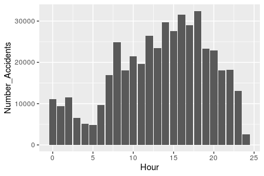

:stylesheet: clean.css

:icons: font

= Los Angeles Traffic Collisions Exploratory Analysis using R datatable and ggplot2 · Wellerson Oliveira

image::/../../images/presentation_image.png[presentation, 250, 250, align = "center"]

[.text-center]
icon:github[size=1.5x, link="https://github.com/wellerson-oliveira", align = "center"] | icon:twitter[link="https://twitter.com/_WellersonVO", align = "center"] | icon:linkedin[link="https://www.linkedin.com/in/wellerson-oliveira-aa121410a/", align = "center"] | icon:google-plus[link="https://plus.google.com/u/0/115562689876020120903", align = "center"]

[.text-center]
**link:/../../index.html[Home Page]**

[.text-center]
_In this article I'll show how to do some exploratory analysis using the R package **datatable**. We are going to use the Kaggle dataset link:https://www.kaggle.com/cityofLA/los-angeles-traffic-collision-data[Los Angeles Traffic Collision Data]. I'll show how to extract date features from your dataset and how to aggregate information based in one or more variables. Finally, I'll show how to do some basic plots using the amazing R package **ggplot2** and how to costumize some features in these plots_ 

---

[.text-left]
Let's begin importing the packages that we are going to use: **datatable** and **ggplot2**. Then let's read the data using the **fread** function provided from the **datatable** package. Since the file is already in a regular csv format, it's not necessary to use any other argument.

[source, ruby]
%% importing packages
   import(data.table)
   import(ggplot2)

[source, ruby]
%% readind data
   dt <- fread(input = "traffic_collision_data.csv")

Now, let's do some cleaning on the dataset. In the kaggle link provided on the top of this article there are the columns description. First, we are going to remove some columns we don't need. Second, let's remove some garbage from the 'Victim Sex' column to keep just the records with F (for females) and M (for males). Finally, let's replace empty spaces in the columns names for the character "_". 

[source, ruby]
%% data cleaning
  dt <- dt[, c(1:6, 11:15)]
  names(dt) <- gsub(" ", "_", names(dt))
  dt <- dt[Victim_Sex == "M"| Victim_Sex == "F", ]

Let's take a look on the resulting dataset. Using the function **head** we can see the firts six records of the data. 

[source, ruby]
  head(dt)

[source, ruby]
   DR_Number           Date_Reported           Date_Occurred Time_Occurred Area_ID
1: 191216137 2019-06-15T00:00:00.000 2019-06-15T00:00:00.000           330      12
2: 191011095 2019-06-15T00:00:00.000 2019-06-15T00:00:00.000          1425      10
3: 190411077 2019-06-15T00:00:00.000 2019-06-15T00:00:00.000          1200       4
4: 190511313 2019-06-15T00:00:00.000 2019-06-15T00:00:00.000           850       5
5: 191814225 2019-06-15T00:00:00.000 2019-06-15T00:00:00.000           435      18
6: 191313246 2019-06-15T00:00:00.000 2019-06-15T00:00:00.000          2000      13
     Area_Name Victim_Age Victim_Sex Victim_Descent Premise_Code Premise_Description
1: 77th Street         39          F              B          101              STREET
2: West Valley         30          M              W          108         PARKING LOT
3:  Hollenbeck         69          M              H          101              STREET
4:      Harbor         39          F              H          101              STREET
5:   Southeast         60          M              H          101              STREET
6:      Newton         NA          M              H          101              STREET

Now we can work on the dataset features. We can see the time information are in the 'Time_Ocurred' column. So let's transform the 'Date_Reported' and 'Date_Occurred' columns in dates. To do this we can get only the first 10 characters of each column and then transform the result in date variables. 

[source, ruby]
 %% creating date variables
   dt[, Date_Reported := as.Date(substr(Date_Reported, 1, 10))]
   dt[, Date_Occurred := as.Date(substr(Date_Occurred, 1, 10))]
  
Based on the variable 'Date_Occurred' we can create some other useful time variables as: Day, day of the week, month and year. We can aggregate the information on the dataset using these variables to identify how the number of accidents are distributed. We are going to construct visualizations for that later in this article. For now, let's create these variables. Then, let's use the variable 'Time_Occured'to get the hour of the day that the accidents occur. For that, we need to divide the value of 'Time_Occurred' by 100 and round the result. Let's ignore the minutes for now.

[source, ruby]
  # - day
  dt[, Day     := format(Date_Occurred, "%d")]
  # - month
  dt[, Month   := format(Date_Occurred, "%m")]
  #- year
  dt[, Year    := format(Date_Occurred, "%Y")]
  # - weekday
  dt[, Weekday := format(Date_Occurred, "%A")]
  # - hour
  dt[, Hour := round(Time_Occurred/100, 0)]

Let's go plot some results. We are going to use the **ggplot2** package for that. The **ggplot2** package is nice because it have a easy syntax. Basically you start defining how the variables are going to be represented on the graph and later you just have to add all the features you want. Starting simple, let's see how the accidents are distributed through the age of the people who suffered. Since we are interested in seeing a distribution, let's use a histogram. First, let's define the axis. For a histogram, we just need to define the x-axis.

[source, ruby]
  # - creating age plot
  p1 <- ggplot(data = dt, aes(x = Victim_Age))

The next step is to define how the data will be showed. Let's use the **geom_histogram** as our geometry to plot data. 

[source, ruby]
  # - creating age plot
  p1 <- p1 + geom_histogram()

We can see the result below.

As we can see, accidents car are more frequently in young people and decreases with the age. Let's improve our visualization using the variable "Victim_Sex" to see how the accidents are distributed between men and women. For that, let's change how the variables going to be represented on the graphic including the "Victim_Sex" variable in the graphic colour.

[source, ruby]
  # - creating age and sex plot
  p1 <- ggplot(data = dt, aes(x = Victim_Age, fill = Victim_Sex)) + geom_histogram()

Here are the result of the code above. As we can see, the **ggplot** automatically separate the two variables with different colours. Because of the histogram geometry it appears there are more accidents with women than accidents with men. But, if we count the number of accidents by the sex of the victim we see the opposite. Let's use the code below to see the number of accidents segmented by the victim sex.

[source, ruby]
  # - counting number of accidents by sex
  dt[, list(N_Accidents = length(DR_Number)), by = "Victim_Sex"]

[source, ruby]
  Victim_Sex N_Accidents
  F          180510
  M          277993	

So, let's try another geometry. We are going to use the **geom_density** for that. The **geom_density** show the data similar to the **geom_histogram** but the curve is showed smoother. For a better visualization let's use the **alpha** parameter to make the curve transparent. Here is the code.

[source, ruby]
  # - ploting the age and sex density
   p1 <- ggplot(data = dt, aes(x = Victim_Age, fill = Victim_Sex, colour = Victim_Sex))+ geom_density(alpha = 0.4)

Now we can see both curves in the correct way. It's important to note the **geom_density** show how each variable it's distributed proportionally to the own variable. So, the part of the curve in the interval 20-40 years where the female curve is higher than the male curve doesn't mean that are more accidents with women than men. It's just means the proportion of 20-40 years women that suffer accidents is higher than 20-40 years men proportion.

To finish this first article, let's see how the accidents are distributed by the hour they happened. Let's use a similar syntax to that we already use. Here is the code to aggregate the number of accidents by the hour of the day.

[source, ruby]
  # - aggregating by hour of the time
   dt.hour <- dt[, list(Number_Accidents = length(unique(DR_Number))), by = c("Hour")]

And here is the code to plot. Now we are using the geometry **barplot**. This geometry is used to create, obviously, bar plots. In this case we have used the parameter **stat** equals to "identity" to tell the function that we already aggregate the data. The default value to this parameter is "stat_count". 

[source, ruby]
  # - plotting
   p2 <- ggplot(data = dt.hour, aes(x = Hour, y = Number_Accidents)) + geom_bar(stat = "identity")
   p2

Here is how our plot looks like now.

Okay, let's improve our plot. Firts, let's change the axis names. For default, **ggplot2** use the columns names as the axis names. let's use the **xlab** and **ylab** parameters to change that. Now, let's put some colour on our plot. To do that, we are going to use again the **fill** parameter. This time, let's use the **ggplot2** documentation to find a colour to our plot. As we can use hexadecimal to change the colours of our graphics, I often use this link:https://htmlcolorcodes.com[site] to find a colour that I like. For this plot I'm going to choose the colour "#212678". It's a kind of dark blue. Finally, let's put a title to our graphic. I'm going to use "Accidents per hour of day". Here is the complete code.

[source, ruby]
  # - plotting
  p2 <- ggplot(data = dt.dow, aes(x = Hour, y = Number_Accidents)) + geom_bar(stat = "identity", fill = "#212678")
  p2 <- p2 + xlab("Hour of the day") + ylab("Number of Accidents")
  p2 <- p2 + ggtitle("Accidents per hour of day")
  p2

And here are the final result. Of course is still a basic plot, but we already use some personalization to do that. I hope you guys enjoyed this article. Until next !

