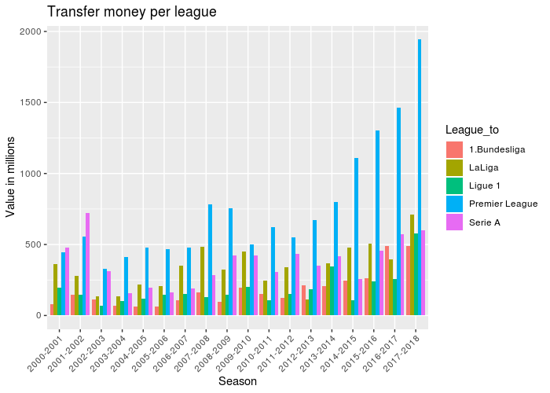
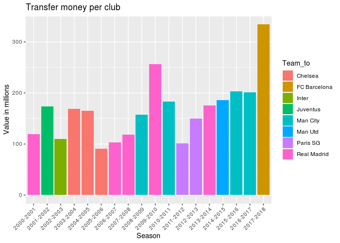
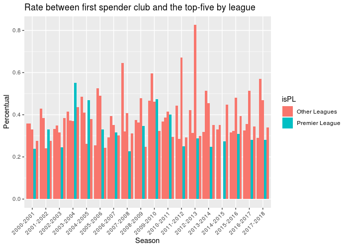

:stylesheet: clean.css

:icons: font

= Why Premier League is the best league in the world - Part I · Wellerson Oliveira

image::/../../images/presentation_image.png[presentation, 250, 250, align = "center"]

[.text-center]
icon:github[size=1.5x, link="https://github.com/wellerson-oliveira", align = "center"] | icon:twitter[link="https://twitter.com/_WellersonVO", align = "center"] | icon:linkedin[link="https://www.linkedin.com/in/wellerson-oliveira-aa121410a/", align = "center"] | icon:google-plus[link="https://plus.google.com/u/0/115562689876020120903", align = "center"]

[.text-center]
**link:/../../index.html[Home Page]**

[.text-center]
_If you like football (or soccer) you already have listen Premier League is the best league in the world. But why? Let's try to find out the answer using data. I've decided to divide this analysis in two parts. This is the part one, and we are going to talk about money. Let's see what premier league does differently from the others. The part two is going to be available soon, and will be focused on the matches. Let's go._ 

---

We are going to use the dataset link:https://www.kaggle.com/vardan95ghazaryan/top-250-football-transfers-from-2000-to-2018[Top 250 Football transfers from 2000 to 2018] to take a look on the transfers of the top-five Europeans League: Premier League, Ligue 1, Bundesliga, Serie A and La Liga. Let's begin importing the data. We are going to remove the Season 2018-2019 because is not complete yet.

[source, ruby]
%%
library(data.table)
library(ggplot2)

[source, ruby]
%% importing transfer data
dt_transfer <- fread(input = "top250-00-19.csv")
dt_transfer <- dt_transfer[Season != "2018-2019"]
dt_transfer[, Transfer_fee := as.numeric(Transfer_fee)]

[source, ruby]
%% top 5 leagues
leagues <- c("Premier League", "Serie A", "LaLiga", "Ligue 1", "1.Bundesliga")

Now, let's see how the five leagues spend money over these years. We are going to aggregate using the variables "Season" and "League_to" and plot how much money each league spend buying players season by season. 

[source, ruby]
%% Comparison with the other top five european league
dt.league <- dt_transfer[League_to %in% leagues, list(Valor = sum(Transfer_fee)), by = c("Season","League_to")]
setorder(dt.league, -Valor)

As we can see, since the 2003-2004 season, Premier League clubs spend more money than all the other top-five European leagues. And the difference is still increasing. But only spend a lot of money is not the key to make the best league. Using the code below, we can see the clubs that spend more money, season by season. 

[source, ruby]
%% Money spent by clubs season by season
dt.club_money_spent <- dt_transfer[League_to %in% leagues, list(Valor = sum(Transfer_fee)), by = c("Season","Team_to")]
setorder(dt.club_money_spent, Season, -Valor)

[source, ruby]
%% getting the first
dt.club_money_spent <- dt.club_money_spent[, .SD[c(1)], by = Season]
 

As we can see, there were eight seasons where a Premier League club spent more money than any other. But there are some clubs like Barcelona, PSG, Real Madrid spending a lot of money too. So, what is different about Premier League? Premier League has more clubs spending money than the others leagues as we can see below.

[source, ruby]
%% Distribution of the money among the clubs
dt.teams_transfer <- dt_transfer[, list(Valor = sum(Transfer_fee)), by = c("Team_to","League_to")]
dt.n_teams_transfer <- dt.teams_transfer[, list(N_Clubs = length(unique(Team_to))), by = "League_to"]
  
        League_to N_Clubs
1: Premier League      42
2:        Serie A      33
3:         LaLiga      27
4:   Super League      23
5:   Championship      23
6:   1.Bundesliga      21

The code above counts how many different clubs by league had at least one transfer in the top-250 in all the seasons. Premier League has almost ten more clubs than the second. And look the Championship! Championship is the second division of the English Football and has more clubs in the top-250 transfers than the Bundesliga! So, why there are so many Premier Leagues clubs in this list? The answer is: Because of the their money division. 

The Premier League TV money is divided by the clubs in a way that medium and small clubs are benefited too. 50% of the money is equally divided among all the clubs, 25% is divided based on the club classification in the last season. The others 25% is divided based in the number of games transmitted. You can look in details link:https://premierleaguebrasil.com.br/premier-league-bilhoes-direitos-tv-divisao/[here].

Let's see another way to confirm this balance. We are going to create a plot showing the rate of the amount spent by the most spender club and the sum of the amount of the top-five spender clubs for each league, season by season. To better visualization, the Premier League will be showed in one color and all the other leagues in another color. 

[source, ruby]
%% creating dt with the amount of money spent by season, league and team
dt.teams_transfer <- dt_transfer[League_to %in% leagues, 
                                   list(Valor = sum(Transfer_fee)), by = c("Season", "Team_to","League_to")]
% - selecting the top-five by season and leagues. 
setorder(dt.teams_transfer, Season, League_to, -Valor)
dt.teams_transfer_top5 <- dt.teams_transfer[, .SD[c(1:5)], by = c("Season", "League_to")]
dt_perc <- dt.teams_transfer_top5[, list(Valor_first = first(Valor),
                                      Valor_sum   = sum(Valor)), by = c("Season", "League_to")]
% - calculating the proportion between the first and the top-five amount
dt_perc[, Perc := Valor_first/Valor_sum]
  

As we can see, excepting for the seasons 2003-2004 and 2004-2005, the Premier League percentual is far from the top. In fact, if we take the average of all the seasons, Premier League has the lower proportion:

[source, ruby]
%%
dt_perc[, list(Mean = mean(Perc, na.rm = T)), by = League_to]

[source, ruby]
        League_to      Mean
1:   1.Bundesliga 0.3814747
2:         LaLiga 0.3985906
3:        Ligue 1 0.4437324
4: Premier League 0.3254344
5:        Serie A 0.3306062

So, related to money, we can see Premier League has some patterns. First, the league spend a lot of money. And the difference to the others leagues is still increasing. But, if we look to clubs like Real Madrid, Barcelona, PSG and etc. They also spend a lot of money. But the problem is: Concentrated money creates unbalanced leagues. So, the second pattern is that in Premier League, the money is better divided than the others leagues. This pattern creates a balanced league. And a balanced league is more attractive.

In the second part, we are going to talk about the matches. Ok, money is well divided among the Premier League clubs. But what about the matches of the leagues? They are balanced? Exciting? People don't watch a league because its have more money. How are the Premier League matchs? We are going to see soon.

Note: The codes presented on this article are not completes (codes to plot, for example, are omitted). Soon I'll provide all the code.

